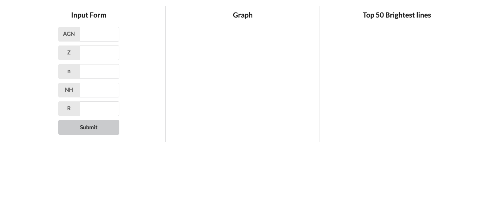

# Black Hole Viewer

Tool used to select a black hole by AGN, Z, n, NH, and R values.

- View the 50 brightest lines of selection.
- Gain access to grid*.con file of selection.
- View an autoscaling graph.

# 
